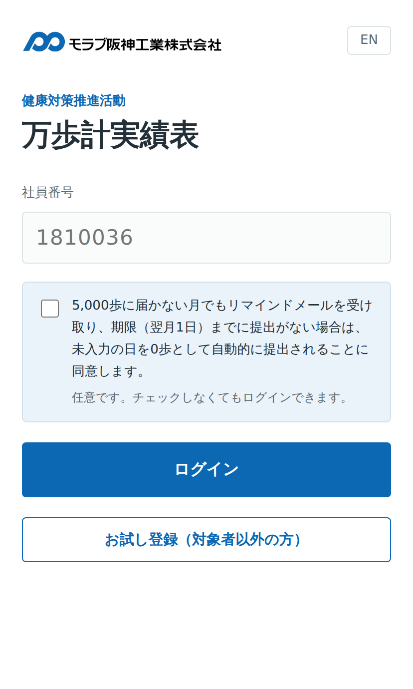

# 万歩計実績表 利用マニュアル — source

The manual is a single HTML file rendered to PDF with **WeasyPrint**.

```
manual.html    the whole document — content and CSS in one file
img/           screenshots referenced by manual.html
```

## Build

```bash
pip install weasyprint
python3 build.py
```

`manual.html` holds every chapter. `build.py` renders three A4 PDFs from it:

| File | Chapters | Pages |
|---|---|---|
| `…_参加者用.pdf` | 01 はじめに, ログイン方法 … リマインドメール, 巻末 | 17 |
| `…_管理者用.pdf` | 01 はじめに, 集計 … 設定, 巻末 | 16 |
| `…_全体.pdf` | everything, original numbering | 28 |

Participants are given the first; the committee keeps the other two.
Participants must not be handed the administrator edition — that is the
reason the manual is split at all.

Build one at a time with `python3 build.py 参加者用`.

Chapters are **renumbered per edition**, so each reads 01, 02, 03 … whichever
chapters it contains. Section ids stay as they are, so the table of contents
page numbers still resolve. To move a chapter between editions, edit the
`keep` list in `build.py` — nothing in `manual.html` changes.

## Before editing, read this

**Do not preview in a browser.** The CSS is print-specific and Chrome will
render it wrong. Several things only work in WeasyPrint:

- `@page` — A4 size, margins, and the running footer with page numbers
- `@page cover` — the cover page has no margins and no footer
- `break-before: page` on `.sec` — every chapter starts on a new page
- `target-counter(attr(href), page)` in the table of contents — this is what
  fills in the page numbers automatically. Edit or reorder chapters and the
  numbers correct themselves on the next build.

**A Japanese font must be installed** or every CJK character renders as a box.
The file asks for `Noto Sans CJK JP`. On Debian/Ubuntu:

```bash
apt-get install fonts-noto-cjk
```

## Structure

Each chapter follows the same pattern:

```html
<section class="sec" id="s02">
  <div class="sec-h"><span class="num">02</span><h2>ログインする<em>Signing in</em></h2></div>
  <div class="rule"></div>
  <p class="ja">Japanese paragraph</p>
  <p class="en">English paragraph</p>
  <figure class="w50"><figcaption>▲ …</figcaption></figure>
  <ol class="steps"><li>step<p class="en">step</p></li></ol>
  <table>…</table>
  <div class="note">…</div>
</section>
```

Japanese first, English underneath in `.en` (smaller, grey). Keep both in sync.

**Adding a chapter:** add the `<section>` and a matching `<li>` in the `.toc`
list. The `href` must match the section `id`. Page numbers look after
themselves.

## Classes

| Class | What it does |
|---|---|
| `.sec` | a chapter — forces a page break before |
| `.en` | the English translation line, grey and slightly smaller |
| `.blue` | inline highlight in the brand blue |
| `.chip` | a small outlined box for UI labels, e.g. `<span class="chip">リスト</span>` |
| `ol.steps` | numbered steps with blue circles |
| `.note` | callout — blue by default |
| `.note.ok` | green callout (ポイント / Tip) |
| `.note.warn` | red callout (注意 / Important) |
| `.flow` | the row of boxes showing the monthly cycle |
| `figure.w40`…`.w100` | figure width as a percentage of the text column |

Inside a `.note`, only the **first** `<b>` becomes the coloured heading — bold
inside paragraphs stays inline. That is deliberate; do not change the
`> b:first-child` selector.

## Colours

Defined once in `:root`. `--brand` (#0C68B3) is sampled from the Morabu
Hanshin logo and matches the app.

## Screenshots

Every screenshot in `img/` is taken against **`demo-roster.json`**, twenty-four
invented people — 山田 太郎 and friends, employee numbers in the 90xxxxx range,
addresses at `example.com`. None of them exist.

They used to be taken against the real roster, which put 147 colleagues' names,
employee numbers and addresses into a document that gets emailed around.
健康対策委員会 asked for that to stop. **Do not retake a screenshot against real
data.** Load the demo roster first:

1. start the app against a throwaway database
2. sign in as the administrator
3. `PUT /api/kv` with `{"key":"roster","value":<contents of demo-roster.json>}`
4. enter some steps as 9000001 so the charts are not empty

## Known gaps

- No screenshot for chapter 09 (完歩賞 tab) — written as a table instead
- `img/mail_preview.png` carries whatever address the browser was on when it
  was taken — the reminder body is built from `window.location.origin`, so a
  screenshot from a test machine shows that machine. Retake it on the live
  site to get the real URL in there
- Issue date on the cover is still 2026年8月18日 — update when reissuing,
  and raise the edition from 第 1 版
- Chapter 02 states there is no password. Update when password login ships;
  the 社員番号がわからない search can come back at the same time, since a
  number alone will no longer be enough to sign in
- The consent is still described as one checkbox. 健康対策委員会 asked for it
  to be split into two — reminder email, and automatic submission — and that
  is on hold pending a discussion, so the app and the manual both still show
  one
- The screenshots carry real names and addresses from the roster. Fine for an
  internal document; worth remembering before it goes anywhere else
